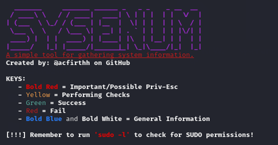
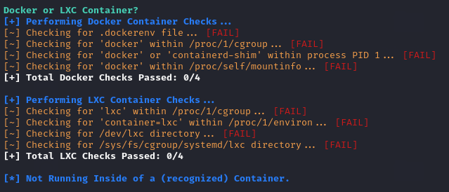
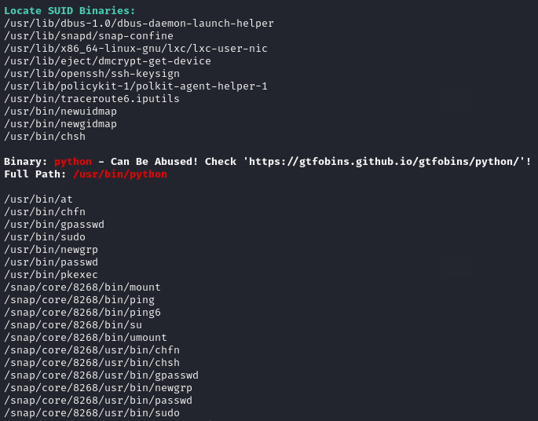
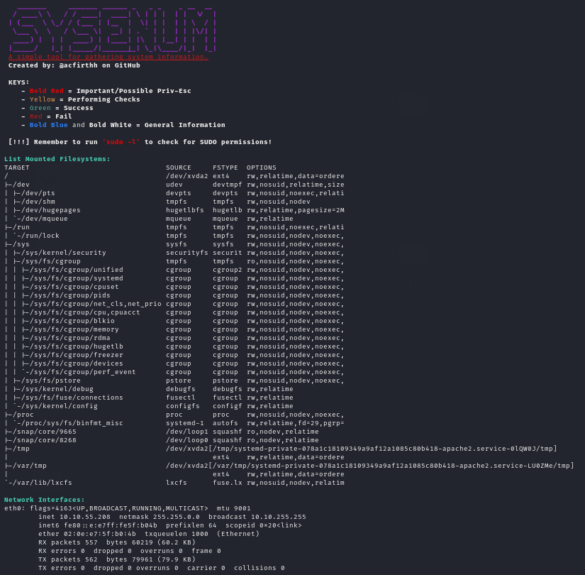

# sysenum

> [!WARNING]
> LEGAL DISCLAIMER:
> This tool is STRICTLY for EDUCATIONAL PURPOSES ONLY!
> Usage of this tool for attacking targets without prior mutual consent is ILLEGAL.
> It is the user's responsibility to obey all laws that apply whilst using this tool.
> The developer of this tool assumes no liability and is not responsible for any misuse
> or damage caused by this program.

## About
The sysenum tool is used to gather information about Linux machine and the files on the machine and display the information to the user to assist in locating local security vulnerabilities and misconfiguratons.

The information from the system can be used either to simply found out more about the machine you are on, or for people doing **CTFs** or **Penetration Testing** to find crucial information that could be used for **Privilege Escallation**.

## Features
The script has a few different functions that perform numerous checks to gather information about the system.

### General (-g)
The *general* function gathers basic information about the machine, including checking if the machine is a **Docker** or **LXC** container, fetching the **hostname**, **current user**, **shell type**, **environment variables**, and all of the users with **login capability** on the machine.

It also gathers information about the Linux version and distribution, **bash** version, **kernel** version, and the **sudo** version.

### Network (-n)
The *network* function gathers **network interface** information and displays the **listening TCP ports** and the IP address that they are listening on.

### Find Interesting (-f)
The *find interesting* function searches the filesystem for 3 types of files. The first being **backup** files, the second is **KeePass** database files which could contain credentials, and the third being **general databases** such as **sqlite** database files.

### Read Files (-r)
The *read files* function reads the contents of the **/etc/passwd** file and the **/etc/crontab** file.

### Filesystem (-f)
The *filesystem* function simply lists all **mounted** filesystems and devices.

### Scan History (-S)
The *scan history* function uses the shell type to decide which history file to read, then uses **grep** to search for keywords and specific strings within the file to reveal potential **usernames** and **passwords**.

### Root Processes (-p)
The *root processes* function displays all of the processes currently being run by the **root** user on the system.

### Exploitable SUID Check (-s)
The *suid check* function locates all of the **SUID** binaries on the machine and then compares each binary to a list of known exploitable SUID or Limited-SUID binaries *(Taken from [GTFOBins](https://gtfobins.github.io/))*. If a binary is found in the list of known exploitable binaries, then it will be highlighted and provide a link to **GTFOBins** referencing that binary.

## Usage
You can run the script without any arguments to run all of the functions automatically and enumerate all information, or you can pass the below arguments to the script to only run specific functions.

**Usage:**\
`./sysenum.sh [-h] [-g] [-n] [-f] [-r] [-m] [-S] [-p] [-s]`

| Optional Argument | What It Does                                                                          |
| ----------------- | ------------------------------------------------------------------------------------- |
| \-h               | Displays the usage section.                                                           |
| \-g               | Display general information about the machine, OS, current user, and system versions. |
| \-n               | Display network interfaces and listening TCP ports.                                   |
| \-f               | Find backup files, KeePass databases, and regular databases.                          |
| \-r               | Reads the contents of /etc/passwd and /etc/crontab.                                   |
| \-m               | Lists mounted filesystems and devices.                                                |
| \-S               | Scan the bash\|zsh history file for potential passwords.                              |
| \-p               | Display processes being run by root.                                                  |
| \-s               | Find SUID binaries and check against a list of known exploitable binaries.            |

You can also call multiple different functions in any order. For example, calling the **filesystem** and **network** functions:\
`./sysenum.sh -m -n`

## Installation
- Clone the repository:\
`git clone https://github.com/acfirthh/sysenum.git`
- Change directory into the **sysenum** directory:\
`cd sysenum`
- Give the script executable permissions:\
`chmod +x sysenum.sh`
- Finally, run the script:\
`./sysenum.sh`

